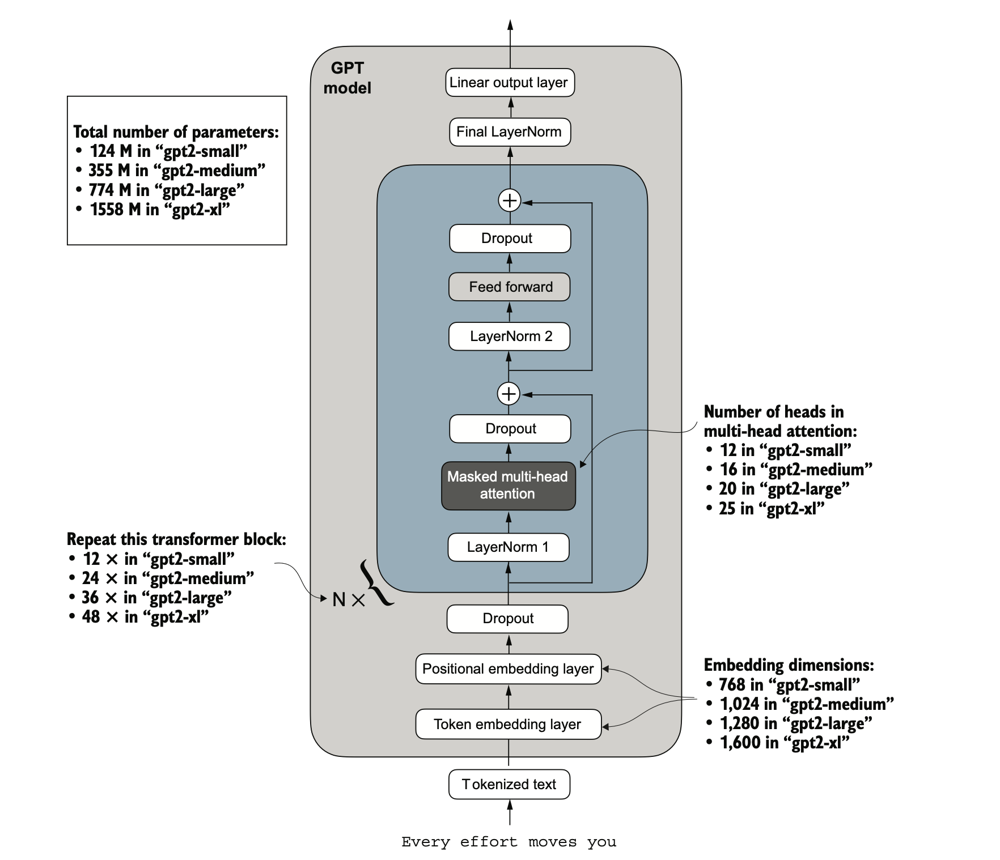

# GPT-2 From Scratch

A PyTorch implementation of the GPT-2 architecture built for experimentation. Use it to train models on custom text or run inference using the original OpenAI weights.

---

## Table of Contents

1. [Project Structure](#project-structure)
2. [Model Architecture](#model-architecture)
3. [Key Features](#key-features)
4. [Setup & Installation](#setup--installation)
5. [Usage: Training](#usage-training)
6. [Usage: Inference](#usage-inference)
7. [Contributing](#contributing)
8. [Acknowledgments](#acknowledgments)

---

## Project Structure

```text
GPT2-From-Scratch/
├── .venv/                      # Virtual Environment
├── data/                       # Dataset storage (input.txt) -> (train.txt, valid.txt, test.txt)
├── model_weights/              # Stores .pth checkpoints (Custom or OpenAI) (Will be created automatically if not present)
├── train.py                    
├── .gitignore
├── dataset.py                  # Custom PyTorch Dataset & Sliding Window logic
├── download_weights.py         # Downloads & converts original OpenAI TF weights
├── download_weights_hf.py      # Maps Hugging Face weights to custom model
├── generate.py                 # Text generation logic (Top-K, Temperature)
├── inference_hf.ipynb          # Inference using Hugging Face weights
├── inference.ipynb             # Inference using Raw/TF converted weights
├── LICENSE
├── model.py                    # GPT-2 Architecture (Attention, FeedForward, Blocks)
├── README.md                   # Project documentation
├── requirements.txt            # Python dependencies
├── train_utils.py              # Loss calculation and visualization helpers
└── train.ipynb                 # Main Training Loop (Load Data -> Train -> Save)
```

---

## Model Architecture 
The model follows the standard **GPT-2 (Decoder-Only Transformer)** design. It processes sequences of tokens to predict the next token in the sequence.



---

## Key Features

-   **Dual Weight Support:**
    -   *Native:* Train from scratch and save as `.pth`.
    -   *Legacy:* Download original OpenAI TensorFlow checkpoints and convert them to PyTorch (`download_weights.py`).
    -   *Modern:* Load weights directly from Hugging Face and map them to the custom architecture (`download_weights_hf.py`).
-   **Gradient Accumulation:** Training loop simulates larger batch sizes on limited hardware by accumulating gradients over multiple steps before updating weights.
-   **Hardware Acceleration:** Automatically detects and utilizes **CUDA** (NVIDIA), **MPS** (Apple Silicon), or CPU.
-   **Custom Generation:** Implements Top-K sampling and Temperature scaling to control the creativity and coherence of generated text.
-   **Auto-Splitting:** The dataset handler automatically splits a single raw text file (`input.txt`) into Train/Validation/Test sets.
-   **Adaptive Data Handling:** Uses a **sliding window approach** with configurable stride to create efficient, overlapping input-target pairs, maximizing data usage from limited text sources.
-   **Weight Tying:** Explains **weight tying** between the token embedding layer and the final output head (a standard GPT-2 optimization) to reduce parameter count (used in the official implementation). But we don't use it in our implementation (explantion provided in notebook).
-   **BPE Tokenization:** Integrates OpenAI's `tiktoken` library for fast **Byte Pair Encoding (BPE)**, enabling efficient subword processing that matches the official GPT-2 vocabulary schema.

---

## Setup & Installation

This project requires Python 3.10 or higher.

### Method 1: Using pip (Standard)

1.  Create and activate a virtual environment:
    ```bash
    python -m venv .venv
    # Windows
    .venv\Scripts\activate
    # macOS/Linux
    source .venv/bin/activate
    ```

2.  Install dependencies:
    ```bash
    pip install -r requirements.txt
    ```

### Method 2: Using uv (Fast & Recommended)

1.  Install uv:
    ```bash
    pip install uv
    ```

2.  Setup environment and install:
    ```bash
    uv venv --python=python3.10
    source .venv/bin/activate
    uv pip install -r requirements.txt
    ```

---

## Usage: Training

To train the model on your own text data:

1.  **Prepare Data:**
    * Rename your text file to `input.txt`.
    * Place it inside the `./data/` folder.

2.  **Launch the Training Notebook:**
    ```bash
    jupyter lab train.ipynb
    ```

3.  **Run the Pipeline:**
    * **Data Loading:** The notebook will detect `input.txt`. If `train.txt` and `valid.txt` don't exist, it will prompt you to auto-split the file.
    * **Configuration:** You can adjust `GPT_CONFIG_124M` (layers, heads) and `SETTINGS` (batch size, learning rate) in the second cell.
    * **Training:** The loop runs for the specified epochs, printing loss and generating sample text at the end of every epoch.
    * **Saving:** The model is saved to `./model_weights/trained_gpt2.pth`.

---

## Usage: Inference

You have two options for generating text.

### Option A: Running Your Custom Model
You can use **either** `inference_hf.ipynb` or `inference.ipynb`.

1.  Open the notebook.
2.  Set the selection variable:
    ```python
    MODEL_SELECTION = "custom"
    ```
3.  Ensure your `trained_gpt2.pth` is located in `./model_weights/`.
4.  Run the notebook to generate text.

### Option B: Running Official GPT-2 Weights
If you want to run the pre-trained 124M, 355M, 774M, or 1558M models, choose one of the methods below based on your needs.

**Method 1: Modern & Fast (Recommended)**
This uses the Hugging Face `transformers` library for faster downloads and caching.

1.  Open `inference_hf.ipynb`.
2.  Select a size:
    ```python
    MODEL_SELECTION = "gpt2-small (124M)" 
    # Or "gpt2-medium (355M)", "gpt2-large (774M)", etc.
    ```
3.  Run the notebook. It will download the official weights via Hugging Face, map them layer-by-layer into your custom `GPTModel` class, and let you generate text.

**Method 2: Legacy & Manual**
This downloads the original OpenAI checkpoints directly from their official Azure bucket (`openaipublic.blob.core.windows.net`) and manually converts them to PyTorch.

1.  Open `inference.ipynb`.
2.  Select a size:
    ```python
    MODEL_SELECTION = "gpt2-small (124M)" 
    # Or "gpt2-medium (355M)", "gpt2-large (774M)", etc.
    ```
3.  Run the notebook. It will fetch the raw files from the OpenAI public server, convert the TensorFlow checkpoints to PyTorch `.pth` format, and load them into your model.

---

## Contributing

Contributions are welcome! Whether it's optimizing the attention mechanism, adding new schedulers, or improving documentation.

### How to Get Started

1.  **Fork the repository**
    ```bash
    git clone https://github.com/yourusername/GPT2-From-Scratch.git
    cd GPT2-From-Scratch
    ```

2.  **Create a feature branch**
    ```bash
    git checkout -b feature/flash-attention
    ```

3.  **Make your changes**
    * Ensure all notebooks run sequentially.
    * If modifying `model.py`, ensure the shapes align in `download_weights.py` to maintain compatibility with official weights.

4.  **Push and Open a PR**
    * Provide a description of your changes.
    * If you improved training speed, please provide metrics.

---

## Acknowledgements

* **OpenAI** for their paper on GPT-2, which defined the architecture used in this project:
    > [*Language Models are Unsupervised Multitask Learners*](https://cdn.openai.com/better-language-models/language_models_are_unsupervised_multitask_learners.pdf).

* **Sebastian Raschka** for his repository and book, which served as a primary reference for my "from scratch" implementation:

    > Raschka, Sebastian. Build A Large Language Model (From Scratch). Manning, 2024. ISBN: 978-1633437166.  
    > Source Code: [Github](https://github.com/rasbt/LLMs-from-scratch).

---

**Star the repository if you found this useful!** 🌟